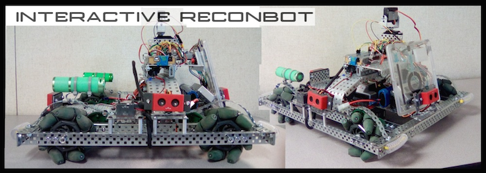

# VEX-Mecanum-Wheel-ROBOTC
The ROBOTC code files for the VEX Mecanum Wheel Robot shown in this image 

Warning - unless your VEX robot is identical in configuration and components, then this code will not compile and run on your VEX Robot. 
Meant as a share and tell experience. 
If you see the phrase "Holonomic" in the code or comments, then that is not completely accurate. 
The 4 Mecanum wheels are all aligned on the same axis, and hence not holonomic. However, there is  omnidirectional meneuverability due to the front and rear wheels being installed such that the pads are pointed in different direction.

There is some apparatus seen on top of the robot in the image, which is a separate system intended for a rotatable camera and resistance pressure pad that sends signals via IR (infra-red) signals.
